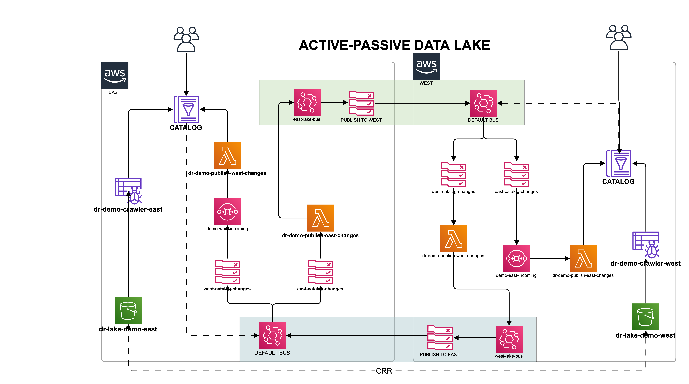

# Real-time Data Lake Replication using Native AWS Services and AWS Glue API


## Overview

Customers today continue to develop and build their cloud data platform using [AWS Modern Data Architecture](https://aws.amazon.com/big-data/datalakes-and-analytics/modern-data-architecture/).  This adoption is due to the availability of the broadest selection of purpose built analytics services.From data movement, data storage, data lakes, big data analytics, log analytics, streaming analytics, business intelligence, and machine learning (ML) to anything in between, AWS offers purpose-built services that provide the best price-performance, scalability , and lowest cost.  

At the core of the modern data architecture is the Scalable Data Lake, which allows customers to store their data in a highly durable object store [Amazon S3](), discover and extract meta data about their data using [AWS Glue Crawler](), catalog extracted meta data using [AWS Glue Data Catalog](), transform their data assets in a uniform manner using [AWS Glue ETL](), provide governance using [AWS Lake Formation]() and access to this data using [AWS Athena]().  

The AWS Glue catalog has become a critical component in this modern data architecture. As a result, customers have begun to inquire about ways to make their catalogs and lakes always available.  These services are [regional]() and are built to be resilient regionally.  While Amazon S3 has the capability  to provide [cross region replication](), the AWS Glue data catalog does not natively provide any such feature.  The only capability today is the [AWS Glue Catalog Replication Utility](https://github.com/aws-samples/aws-glue-data-catalog-replication-utility), which allows customers to configure and build some replication functionality.

The catalog replication utility allows the replication of the catalog from one AWS account to one or more AWS accounts.  The utility has dependencies on [Java]() and [JQ](https://stedolan.github.io/jq/).  Additionally, it requires building, deploying and running the replication tasks from a commandline.  There are also stated limitations:  
* Not intended for real-time replication  
* Not intended for two-way replication
* Does not resolve database and table name conflicts  

## Solution 
This architecture removes some of the limitations of the catalog replication utility and makes it easier to deploy and integrate.  It leverages highly resilient core services, and uses Python instead of Java.  THe initial implementation allows for the configuration of an "active-passive" data lake replication setup and can easily be setup to replicate in a multi-region configuration.

The replication is near real-time using the AWS EventBridge's eventbus for cross region and cross account messaging and communications.  When activated, the replication occurs for every change to the catalog.  These changes may be triggered from the AWS Console, commandline or API calls from other services such as AWS Glue Crawler.

### Prerequisites  
There are no external prerequisites to implement this architecture.  All services are native AWS foundational services:
* Compute: AWS Lambda
* Event Management and Messaging: AWS EventBridge (Bus, Rules)
* Queue Management: AWS Simple Queue Service (SQS)
* Catalog: AWS Glue Data Catalog (Data Lake Requirement)
* Storage: Amazon S3 (Data Lake Requirement)
* SDK: AWS SDK (Boto3)

#### [Architecture Diagram](https://go.gliffy.com/go/publish/13636362)


### Artifacts and Objects
#### Region A (East)  
* S3
>> dr-lake-demo-east  

* Glue Crawler  
>> dr-demo-crawler-east

* Glue Catalog  
>> database-x

* Lambdas
>> dr-demo-publish-west-changes  
>> dr-demo-publish-east-changes  

* Queues  
>> demo-west-incoming  
>> dr-east-dlq

* EventBridge  
>> west-catalog-changes (rule)  
```json
{
  "detail-type": ["Glue Catalog East"],
  "source": ["west.catalog.updates"],
  "region": ["us-west-2"]
}
```
>> east-catalog-changes (rule) --> Lambda (dr-demo-publish-east-changes) [DLQ]
```json
{
  "source": ["aws.glue"],
  "region": ["us-east-1"],
  "detail-type": ["Glue Data Catalog Database State Change", "Glue Data Catalog Table State Change"]
}
``` 
>> east-lake-bus 
```json
{
  "AWSTemplateFormatVersion": "2010-09-09",
  "Description": "CloudFormation template for EventBridge event bus 'east-lake-bus'",
  "Resources": {
    "EventBus": {
      "Type": "AWS::Events::EventBus",
      "Properties": {
        "Name": "east-lake-bus"
      }
    },
    "EventRule0": {
      "Type": "AWS::Events::Rule",
      "Properties": {
        "EventBusName": "east-lake-bus",
        "EventPattern": {
          "detail-type": ["Glue Catalog East"],
          "source": ["east.catalog.updates"],
          "region": ["us-east-1"]
        },
        "Name": "publish-to-west",
        "State": "ENABLED",
        "Targets": [{
          "Id": "Id84f9ab38-43ef-414d-a91d-12cfd97bc006",
          "Arn": "arn:aws:events:us-west-2:664568786592:event-bus/default",
          "RoleArn": "arn:aws:iam::664568786592:role/service-role/Amazon_EventBridge_Invoke_Event_Bus_1242915447"
        }]
      },
      "DependsOn": ["EventBus"]
    }
  }
}
```

>> default (bus)


#### Region B (West)  
* Lambdas
>> dr-demo-publish-west-changes
>> dr-demo-publish-east-changes
* Queues  
>> demo-east-incoming  
>> dr-west-dlq  
* Glue Catalog  
>> database-x
* EventBridge  
>> west-lake-bus (bus)  
```json
{
  "AWSTemplateFormatVersion": "2010-09-09",
  "Description": "CloudFormation template for EventBridge event bus 'west-lake-bus'",
  "Resources": {
    "EventBus": {
      "Type": "AWS::Events::EventBus",
      "Properties": {
        "Name": "west-lake-bus"
      }
    },
    "EventRule0": {
      "Type": "AWS::Events::Rule",
      "Properties": {
        "EventBusName": "west-lake-bus",
        "EventPattern": {
          "detail-type": ["Glue Catalog West"],
          "source": ["west.catalog.updates"],
          "region": ["us-west-2"]
        },
        "Name": "publish-to-east",
        "State": "ENABLED",
        "Targets": [{
          "Id": "Iddc45f2d4-8026-4bb8-9f53-11eaecd04aa7",
          "Arn": "arn:aws:events:us-east-1:664568786592:event-bus/default",
          "RoleArn": "arn:aws:iam::664568786592:role/service-role/Amazon_EventBridge_Invoke_Event_Bus_1732746282"
        }]
      },
      "DependsOn": ["EventBus"]
    }
  }
}
```
>> east-catalog-changes (rule)  --> Queue (demo-east-incoming)
```json
{
  "detail-type": ["Glue Catalog East"],
  "source": ["east.catalog.updates"],
  "region": ["us-east-1"]
}
```
>> west-catalog-changes (rule)  --> Lambda (dr-demo-publish-west-changes)
```json
{
  "source": ["aws.glue"],
  "region": ["us-west-2"],
  "detail-type": ["Glue Data Catalog Database State Change", "Glue Data Catalog Table State Change"]
}
```
>> default (bus)
* S3
>> dr-lake-demo-west
* Glue Crawler  
>> dr-demo-crawler-west


## Authors and acknowledgment
Sebastian Muah  (@sebmuaht)  
Sushant Bhagat

## License
For open source projects, say how it is licensed.

## Project status
If you have run out of energy or time for your project, put a note at the top of the README saying that development has slowed down or stopped completely. Someone may choose to fork your project or volunteer to step in as a maintainer or owner, allowing your project to keep going. You can also make an explicit request for maintainers.
